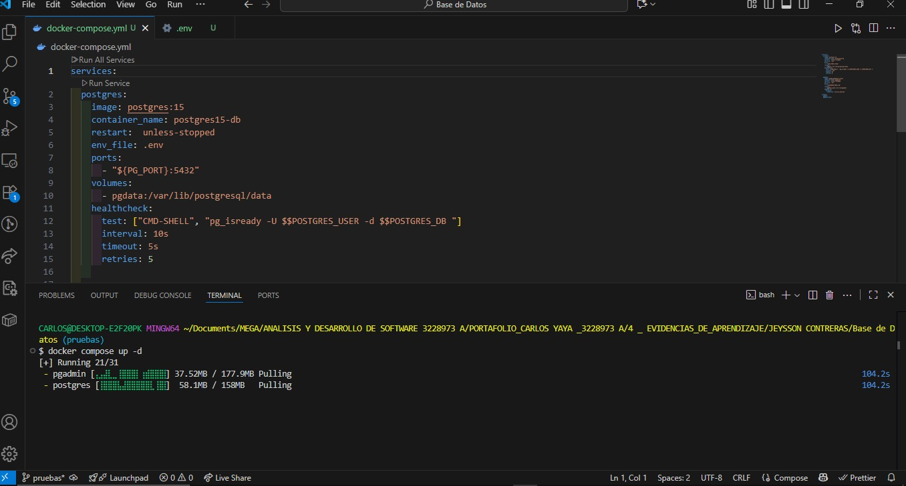
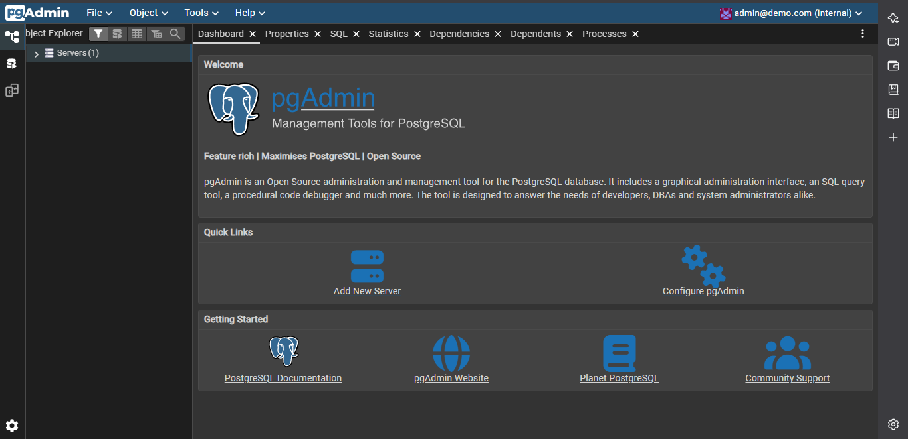
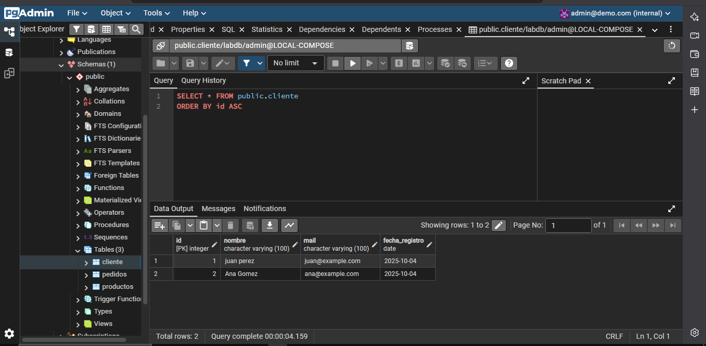

## proceso para levantar  Docker

Se debe tener abietto docker para luego ejecutar en la terminal
'docker compose up -d' 

Luego se ingresa al sistema con las credenciales.

Se realiza la creación de tablas en en visual code y se va actualizando en la terminal con: 
' docker exec -i postgres15-db psql -U admin -d labdb < labs/labs_restricciones/script.sql' 

' docker exec -i postgres15-db psql -U admin -d labdb < labs/labs_fundamentos/script.sql'

Esto para este caso. 
